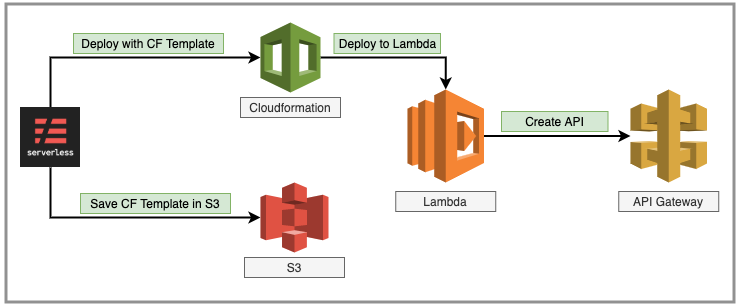
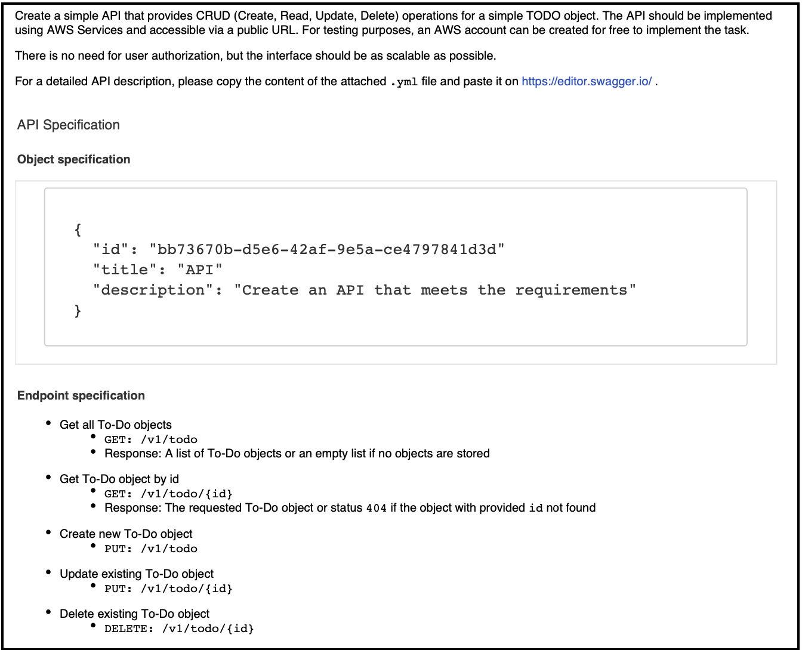

# Todo Serverless Service

This project generated using serverless node generator

## Requirements

 - [Node v16+](https://nodejs.org/en/download/current/)
 - [Yarn](https://yarnpkg.com/en/docs/install)
 - [Serverless Framework](http://serverless.com/)

## Distribution ##

- **[Swagger API Docs](task_swagger.yml)** Copy the content of the file to https://editor-next.swagger.io/ and test all the endpoints
- [A Postman Collection](https://api.postman.com/collections/1932091-86c21e00-890a-45b4-aa04-20749d1b4637?access_key=PMAT-01GMNYB0D8AJDQ96KW0MRFHSRP)
- [Sonar Project](https://sonarcloud.io/dashboard?id=naeemark_todo-serverless)

---

### Deployment ###

### What is this repository for? ###

* This app is built as assignment for SDA.
* Adds different libs to enhance the application quality and performance.
* Using Serverless Framework for the ease of deployment.
* Using [SWAGGER.IO](www.swagger.io) for documentation and as a working REST-API client
* CI/CD Demonstration using [Github Actions](https://github.com/features/actions)
* Version 1.0.0

### Problem Statement:

### Proposed Solution:

- A serverless application to provide the required endpoints backed with Lambbda functions and DynamoDB will serve the purpose
- Local instance of DynamoDB will be used for local dev environments.
- For testing of service, I would prefer to use jest and supertest
- For demonstration purpose, an API frontend should be provided...i.e Swagger

#### Entities ####
- There will be only one table created in DynamoDB according to the provided schema attributes in problem statement

### Deliverable Content ###

#### Functional Implementation ####
* **GET** `{baseURL}/v1/todo` - Gets list of all todo's 
* **GET** `{baseURL}/v1/todo/{id}` - Gets a todo by id
* **POST** `{baseURL}/v1/todo` - Creates a new todo
* **PUT** `{baseURL}/v1/todo` - Creates/updates a todo based upon provided values
* **PUT** `{baseURL}/v1/todo/{id}` - Updates/Modifies a todo by provided id and values
* **DELETE** `{baseURL}/v1/todo/{id}` - Deletes a todo by Id
#### Non-Functional Implementation ####
* **GET** `{baseURL}/hello` - Checks the health of the system,

### Development Cycle:
- Distributes the whole development into Small tasks
- [Each Issue](https://github.com/naeemark/todo-serverless/issues?q=is%3Aissue) shows a feature
- [Each commit](https://github.com/naeemark/todo-serverless/commits/master) shows a small progress
- [Pull Requests](https://github.com/naeemark/todo-serverless/pulls?q=is%3Apr+is%3Aclosed) are done for major tasks

## Getting Started

How to set up

- You need to [configure aws credentials](https://docs.aws.amazon.com/cli/latest/userguide/cli-chap-configure.html) locally, for this service a local profile is being used, which should be relapaced accordingly in `package.json`
- To set-up the project locally you need to clone this repo, from `main` or some latest TAG

Install dependencies:

- `yarn`

## Running Locally

- `yarn dev`

## Running in Production

- `yarn deploy`

## Lint

- `yarn lint` # lint code with ESLint

- `yarn lint --fix` try to fix ESLint errors

## Distribution

### Postman Collection

- [Download Collection](https://api.postman.com/collections/1932091-86c21e00-890a-45b4-aa04-20749d1b4637?access_key=PMAT-01GMNYB0D8AJDQ96KW0MRFHSRP)

## License

[MIT License](README.md) - [Naeem]
